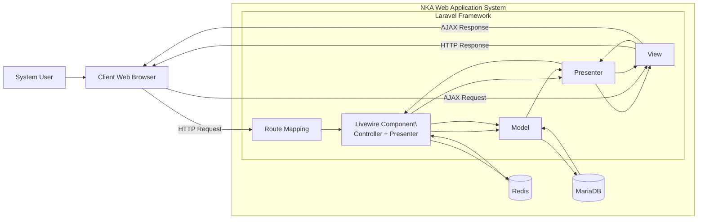
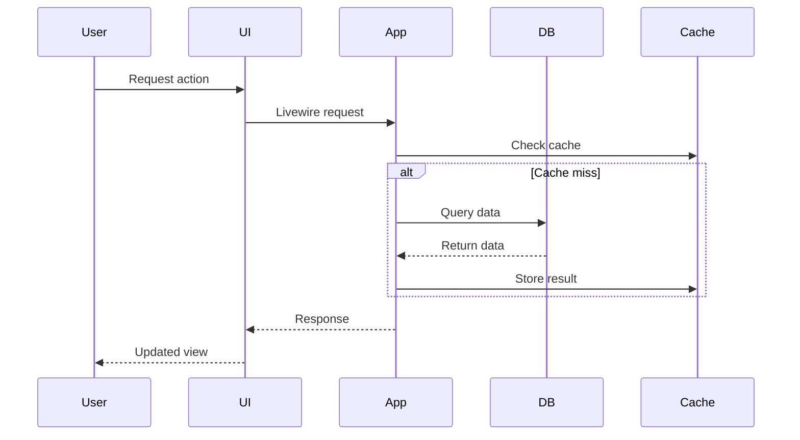

# 🏗️ System Architecture  
_**NKA Academic Management System**_

---
## 📌 Overview

The NKA Academic Management System is designed as a **modular, scalable web application** that supports multi-stakeholder academic operations.

The architecture combines:

- Laravel MVC (server-side structure)
- Livewire component model (reactive UI)
- Role-Based Access Control (RBAC)
- Docker-based infrastructure

This hybrid approach enables the system to deliver **modern interactive behaviour** while maintaining **server-side simplicity and maintainability**.

---
## 🧭 Architectural Overview

The system follows a layered architecture separating concerns across:

- Client Layer → User interaction (AdminLTE + Livewire)
- Application Layer → Business logic (Laravel + RBAC)
- Data Layer → Persistent storage (MariaDB)
- Services Layer → Performance optimisation (Redis)
- Infrastructure Layer → Deployment (Docker + Nginx)

👉 A high-level diagram of these layers is provided in the README.

This section focuses on how these layers interact internally.

---
## 🔍 MVC + Livewire (MVP-Style Interaction)

This section zooms into the application layer to explain how user interactions are processed internally.

To support dynamic UI without heavy JavaScript frameworks, the system combines:

* Laravel MVC
* Livewire’s component-based reactive model



### 💡 Explanation

* Livewire components act as **Controller + Presenter**
* The system maintains **server-side rendering**
* AJAX (`wire:*`) enables **SPA-like behaviour**
* Redis improves performance through caching

---
## 🔐 Authentication & Authorization

The system uses a **multi-guard architecture**:

* `web` → staff (sysadmin, superadmin, admin)
* `student` → learners
* `employer` → external stakeholders

Authorization is handled using **Spatie Laravel Permission**:

* Roles define access levels
* Permissions define specific actions

This ensures:

* strict access control
* separation between user groups
* scalable permission management

---
## 🧱 Data Architecture

The database follows a **normalised relational design**:

* MariaDB as primary datastore
* Pivot tables used extensively for flexibility

Examples:

* programme ↔ module
* module ↔ skill
* student ↔ batch

This allows:

* dynamic academic structures
* reusable module design
* alignment with UK RQF standards

---
## ⚡ Caching Strategy

The system uses **Redis-based caching with tags**:

```
Cache::tags(['programme'])->remember(...)
```

Benefits:

* reduces repeated database queries
* improves response time
* supports scalable data access

---
## 🐳 Infrastructure Design

The system runs in a **Dockerised environment**:

* Laravel (PHP-FPM)
* Nginx
* MariaDB
* Redis
* Node (Vite)

Benefits:

* consistent development environment
* easy onboarding
* production-like setup locally

---
## 📊 Data Flow Summary


---
## 🚧 Current Scope (Phase 1)

### ✅ Completed

* Staff-side system (web guard)
* RBAC implementation
* Academic structure management
* CRUD operations and dashboards
* Docker-based deployment

### ⚠️ Partial

* Student module (authentication + basic UI)
* Employer module (authentication + basic UI)

---
## 🔮 Future Architecture Direction

The system is designed for expansion into a **full multi-stakeholder platform**.

---
## 🤖 AI Integration Roadmap

To align with modern AI-driven systems, the architecture supports future integration with external AI services.


### 🎯 Relevance to AI Engineering

These enhancements are intentionally aligned with real-world AI engineering practices, including:

- data-driven decision systems  
- predictive modelling pipelines  
- recommendation systems  
- microservice-based ML integration  

This positions the system as a foundation for transitioning into AI-driven applications.

#### 🔹 1. Intelligent Module Recommendation

* Suggest modules based on:

  * student performance
  * skill gaps


#### 🔹 2. Student Performance Prediction

* Predict:

  * academic risk
  * completion likelihood


#### 🔹 3. Employer Matching System

* Match students to opportunities based on:

  * skills
  * modules completed


#### 🔹 4. AI-Powered Insights Dashboard

* Trends and predictions for administrators


#### 🔹 5. Python AI Microservices Integration

```
Laravel → API → Python (ML Model) → Response
```

Technologies:

* FastAPI / Flask
* Scikit-learn / TensorFlow
* REST APIs

---
## 🎯 Design Principles

The system is built around:

* modularity
* scalability
* separation of concerns
* reusability
* maintainability

---
## 📌 Final Note

This architecture demonstrates the transition from traditional web application design to a system capable of supporting AI-driven enhancements, making it suitable for modern, data-oriented applications.