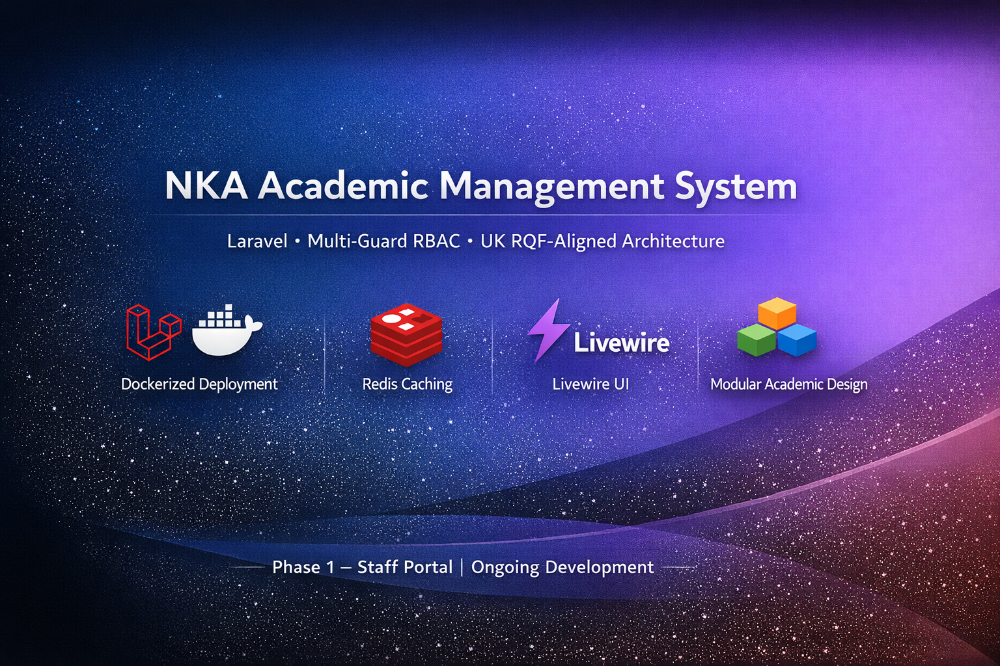
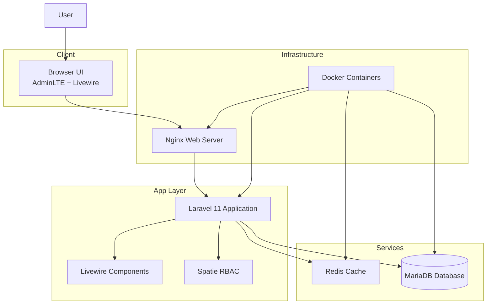
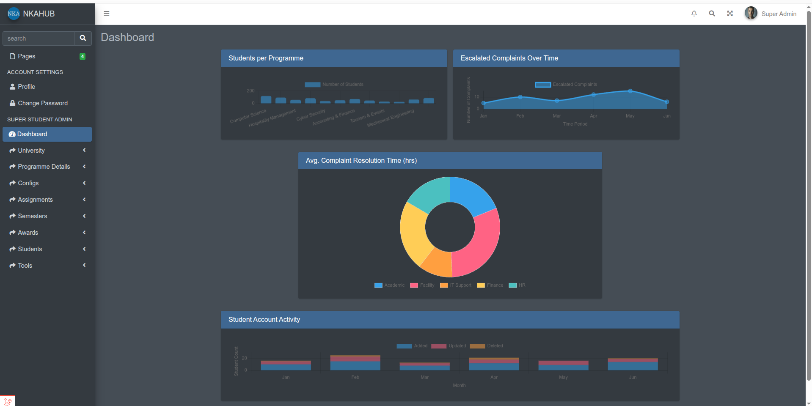
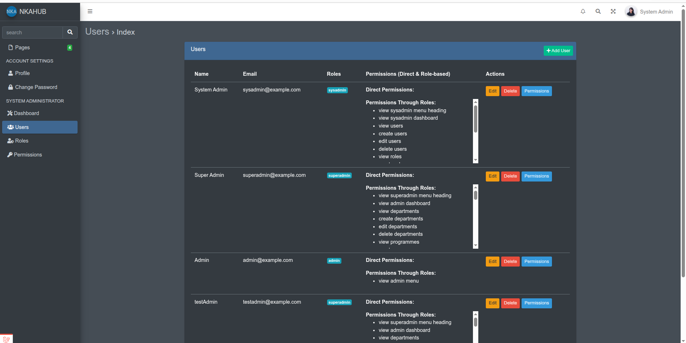
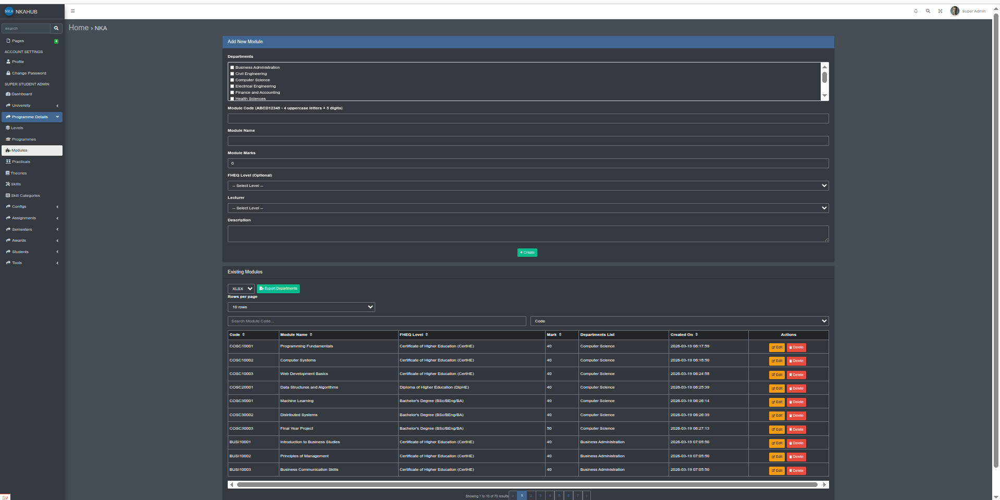

<p align="center">
  
</p>

# 🎓 NKA Academic Management System (Phase 1)


A Laravel-based academic management system designed using **UK RQF standards**, featuring **multi-guard RBAC**, modular curriculum structure, and Docker-based deployment.

---
## 📌 Project Overview

This project is part of a **BCS Professional Graduate Diploma (PGD)** submission (Distinction) and represents a **real-world system design and implementation**.

The system aims to unify academic and administrative operations into a scalable, role-based platform.

---
### 🧭 Explore the Architecture

For a detailed breakdown of the system design and internal interactions:

👉 [ARCHITECTURE.md](ARCHITECTURE.md)

---
## 🏗️ System Architecture


---
## 🎯 Project Scope

This repository represents **Phase 1 of the system**, focusing on the **staff-side implementation**.

Originally designed for:

- Staff (Administrators)
- Students
- Employers

👉 Due to time constraints and system complexity, this version delivers a **fully functional staff portal**, with other modules planned for future development.

---
## 📸 System Preview

### 🖥️ Dashboard


### 👥 User Management


### 📚 Module Management



---
## 🧭 How to Explore This Project

### 🎓 For Students
- Read the report  
- Follow SETUP.md  
- Import dataset  
- Study RBAC and architecture  

### 💼 For Recruiters
- Review ARCHITECTURE.md  
- Explore Livewire components  
- Check RBAC implementation  

---
## 📊 Sample Dataset

Sample data is provided to help explore the system.

👉 [Dataset Import Guide](docs/dataset-guide.md)

---

## 📘 Project Report

Full academic report:

👉 [View Report](docs/report/NKA_Project_Report.pdf)

---
## ⚠️ Academic Integrity Notice

This project is published for **educational and reference purposes only**.

Students are encouraged to:
- study the architecture  
- understand the implementation approach  
- learn how to structure a distinction-level project  

However:

❌ Do NOT copy code directly  
❌ Do NOT submit this work (fully or partially) as your own  
❌ Do NOT reuse this project in academic submissions  

Academic misconduct may lead to serious consequences in your institution.

Use this project to **learn, not to copy**.

---
## 🚧 Current System Status

### ✅ Completed (Core System)

- System Administrator, Superadmin, and Admin dashboards
- Role-Based Access Control (Spatie Permissions)
- Programme, Level, Module, Skill management
- Curriculum structure aligned with UK RQF
- Batch and configuration management
- Reusable DataTable (search, sort, pagination, export)
- Docker-based environment (Nginx, MariaDB, Redis)
- Redis caching with tagged strategy

---
### ⚠️ Partially Implemented

- Student portal (authentication + basic UI scaffolding)
- Employer portal (authentication + basic UI scaffolding)

---
### 🔮 Planned Enhancements

- Full student lifecycle management
- Employer integration (internships, recruitment)
- Automated alerts and notifications
- Reporting and analytics dashboards
- Academic progression tracking

---
## ⚙️ Tech Stack

| Category        | Technology |
|----------------|-----------|
| Backend        | Laravel 11 |
| Frontend       | Livewire 3 + AdminLTE 3 |
| Database       | MariaDB |
| Caching        | Redis |
| Containerisation | Docker |
| Testing        | Pest |
| Build Tools    | Vite |

---
## 🚀 Quick Start

To run this project locally using Docker, follow the setup guide:

👉 [SETUP.md](SETUP.md)

This guide covers:

- Docker environment setup
- Database migration and seeding
- Sample dataset import
- Application access instructions

---
## 🔐 Default Credentials

The system includes pre-seeded user accounts for testing different roles.

### 📌 Password for all accounts
```text
password
```
---
### 👥 Staff Accounts (web guard)

| Role        | Email                  |
|------------|------------------------|
| Sysadmin   | sysadmin@nka.test      |
| Superadmin | superadmin@nka.test    |
| Admin      | admin@nka.test         |

---
### 🎓 Student Account (student guard)

| Role    | Email                |
|--------|----------------------|
| Student | student@example.com |

---
### 🏢 Employer Account (employer guard)

| Role     | Email                  |
|----------|------------------------|
| Employer | employer@example.com  |

---
### 💡 Notes

- All accounts use the same password for simplicity in testing  
- Student and employer modules are partially implemented (Phase 1)  
- These accounts allow you to explore authentication and role-based access  
---

### 👤 Available Roles

You can log in using any seeded user based on their assigned role:

- System Admin  
- Superadmin  
- Admin  

---
## 🧪 Seeder Strategy

To simplify setup:

* Only **SpatieSeeder** and **StakeholderSeeder** are used
* Complex academic seeders have been removed from the default flow

👉 This keeps setup fast and clean.

Optional: You may import your own dataset or extend seeders as needed.

---
## ⚡ Caching Strategy

* Redis-based caching
* Tagged cache per model

Example:

```php
Cache::tags(['level'])->remember('levels_all', now()->addHour(), function () {
    return Level::orderBy('fheq_level')->get();
});
```

---
## 📚 Learning Value

This project demonstrates:

* Multi-guard authentication architecture
* Role-based access control (RBAC)
* Modular system design (academic domain)
* Docker-based development workflow
* Clean UI architecture with reusable components
* Real-world problem solving under constraints

---
## ⚠️ Important Notes

* This is a **Phase 1 implementation**
* Student and employer modules are **not fully implemented yet**
* All data used is **synthetic (generated using Faker)**

---
## 👨‍💻 Author

**Rukman Bernard**

* LinkedIn: [https://www.linkedin.com/in/rukman-bernard](https://www.linkedin.com/in/rukman-bernard)
* ORCID: [https://orcid.org/0009-0001-2737-8367](https://orcid.org/0009-0001-2737-8367)
* Research GitHub: [https://github.com/rukman-b](https://github.com/rukman-b)

---
## ⭐ Final Note

This project is part of a **continuous learning journey** and will be extended in future versions to support full multi-stakeholder functionality.

